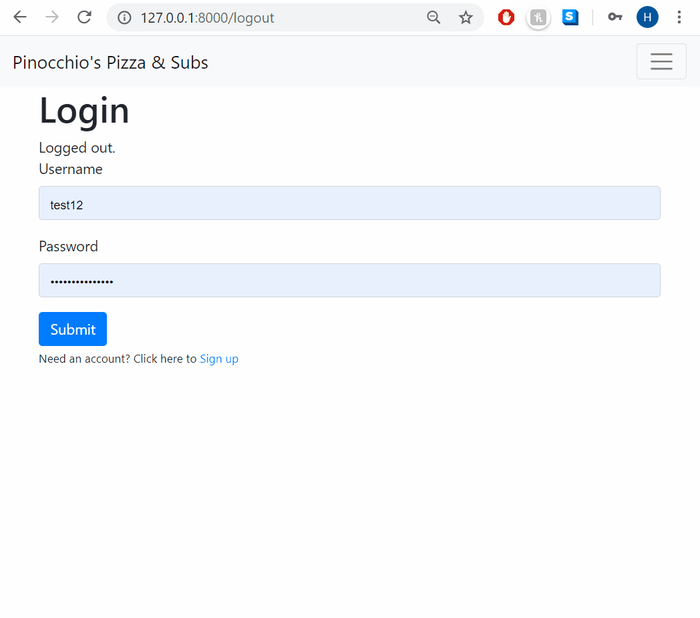

# Online Restaurant WebApp: Pinocchio's

The goal of this project is to build an web application using Django for handling a pizza restaurant’s online orders. Users will be able to browse the restaurant’s menu, add items to their cart, and submit their orders. Meanwhile, the restaurant owners will be able to add and update menu items, and view orders that have been placed.

On this web app, users can :
- Register, login, browse the menu and items to their cart. 
- If appropriate, they can add topping and extras.
- Once an order is complete, user can decide to place an order. 

After submission, the items will be remove from the current cart and the site administrator can:
- See a new order on the admin interface that he/she can mark as completed.
- Add or update category and name of product if needed.

This project was originally started with the distribution code from https://cdn.cs50.net/web/2020/x/projects/3/project3.zip

## Achievements

* Menu: The web application support all of the available menu items for [Pinnochio’s Pizza & Subs](http://www.pinocchiospizza.net/menu.html). Based on analyzing the menu and the various types of possible ordered items (small vs. large, toppings, additions, etc.), I created 8 models:
    * Category : To differentiate items and allow the customization of topping, size and extra.
    * Size : Small and Large
    * Topping + Extra : To see the list of items
    * Price_List : To determine a base price and supplement price (if large option)
    * Item_List : Which list the name of article and associate it with the price list
    * Cart_List : To allow users to add and remove items to their cart
    * Order : To see the orders placed
* Adding Items: Using Django Admin, site administrators (restaurant owners) are able to add, update, and remove items on the menu. All of the items from the Pinnochio’s menu were also added into the database running Python commands in Django’s shell (import.py file).
* Registration, Login, Logout: Site users (customers) are able to register for the web application with a username, password, first name, last name, and email address. Customers can then log in and log out of the website.
* Shopping Cart: Once logged in, users see a representation of the restaurant’s menu, where they can add items (along with toppings or extras, if appropriate) to their virtual “shopping cart.” The contents of the shopping is saved even if a user closes the window, or logs out and logs back in again.
* Placing an Order: Once there is at least one item in a user’s shopping cart, users can place an order.
* Viewing Orders: Site administrators have access to a page where they can view any orders that have already been placed.

## How to run this application

### Prerequisites

- Python
- Run `pip3 install -r requirements.txt` to install Django

### Steps

To run this application on your laptop, run this command from your terminal:

`$ python manage.py runserver`
or `$ python3 manage.py runserver`

Copy paste the URL link to your web browser

`Starting development server at http://127.0.0.1:8000/`

## How to run the admin interface

While the application is running on your local computer, go tho this url: http://127.0.0.1:8000/admin/

To create a superuser, follow this tutorial: https://docs.djangoproject.com/en/1.8/intro/tutorial02/

To get more information about this web app, check out this video https://www.youtube.com/watch?v=nhwRe9PW50k&t=48s